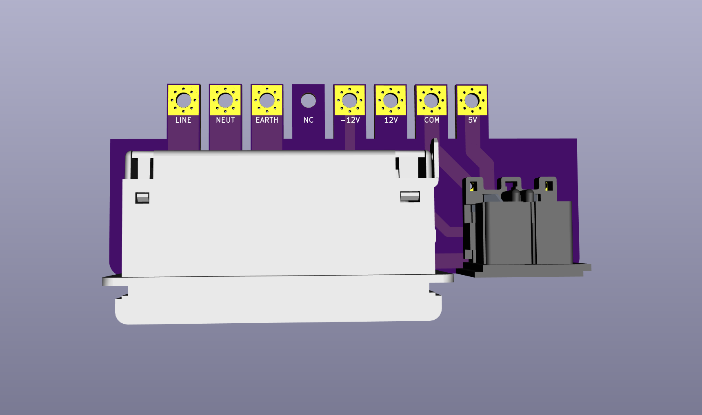
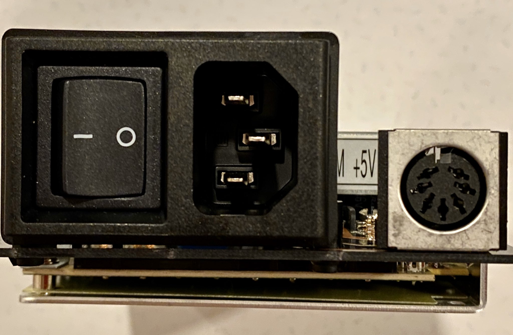

# rt65b_power_module

This is a power input/output board for the Mean Well RT65-B power supply.

This supply is commonly used as a replacement for the Amiga 500 power supply.

## Ordering

If you'd like to quickly order some boards I [published the project at Oshpark](https://oshpark.com/shared_projects/dqlXqoSQ)

## BOM

The AC power entry module footprint is a Schurter KP01.1112.11 and the DC output is a circular DIN-7.

## Warning

USE EXTREME CAUTION WITH AC POWER! YOU COULD EASILY KILL YOURSELF IF YOU DON'T KNOW WHAT YOU'RE DOING.

Don't use this without an appropriate case/shielding to prevent possible injury and shock. In fact don't use it if you don't know exactly what you're doing.
